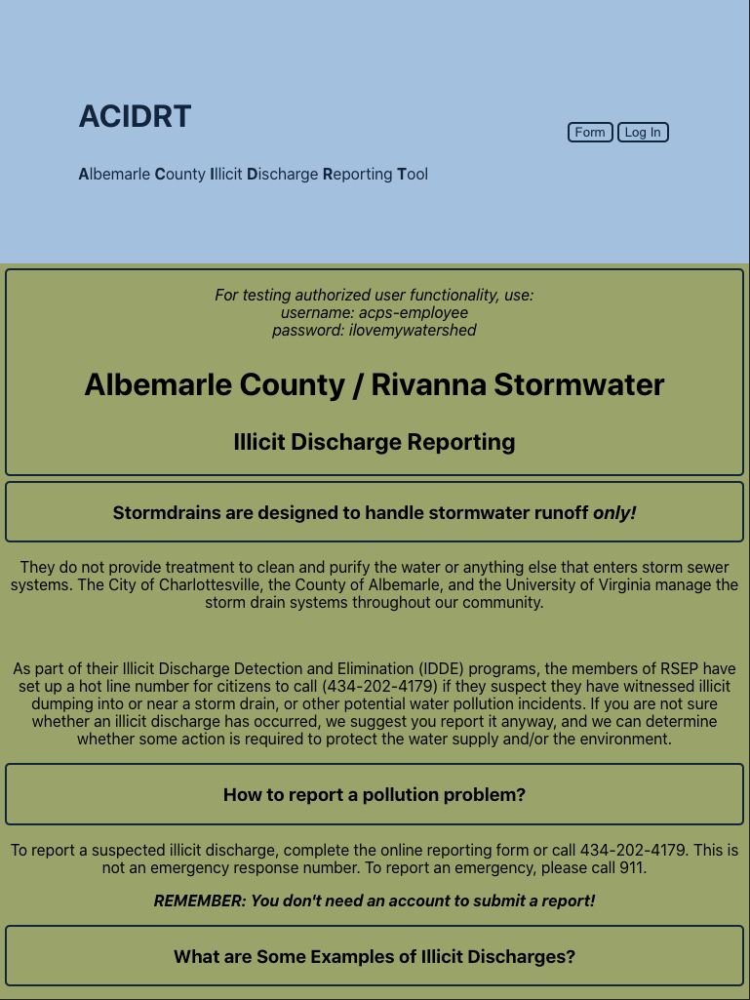
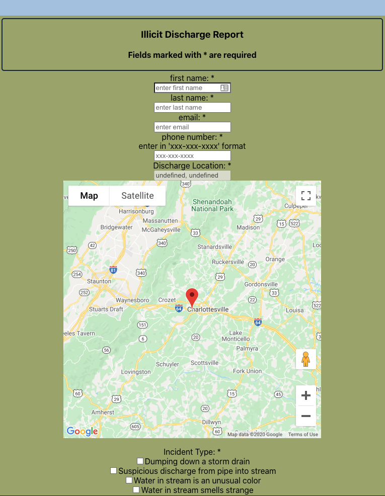
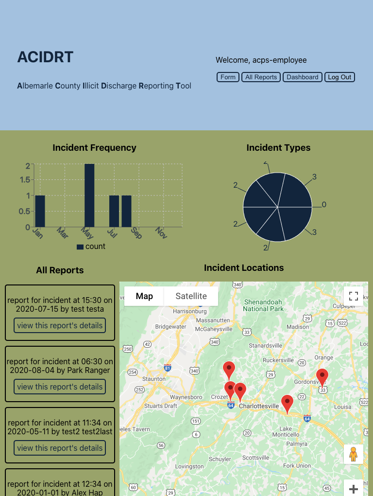
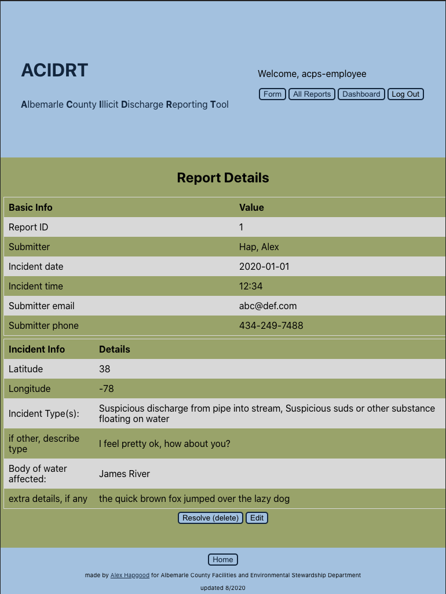

# ACIDRT

**_ACIDRT - Albemarle County Illicit Discharge Reporting Tool_**

This is a reporting tool designed for members of the public to report illicit discharge (improper disposal
of waste water). The tool also includes functionality for civil servants to access
a dashboard displaying aggregated information at a glance, as well as all the reports
submitted to that point, with the ability to edit and delete them.

- Server repo found [here](https://github.com/meta-434/acidrt-api)
- Live site found [here](https://acidrt.alex-hapgood.info/)

## Concept

The design of the tool is aimed around two user types - a member of the public intending to submit a report,
and an employee of the parks department to access the submitted reports.

Both users see the main page describing the details of illicit discharge and what constitutes a report-worthy
sighting. From here, the member of the public may access the form page, where they can input information to identify
themselves for future contact from the parks department, as well as information about the incident they wish to report,
including a map with a draggable pin to help field employees of the parks department precisely identify the incident in
question.

The employee, upon login, is presented with a dashboard providing a quick rundown of the submitted reports, incuding
a labeled pin-map of all incidents submitted, a freq/time bar chart, and an incident type breakdown chart, and the full
list of reports for easy access when conferring with the map's pin labels.

On selection of an incident, the employee is given the full details as submitted by the member of the public, as well
as the ability to update the report, and delete it, should this be the case.

## Set up

set up the server, from `https://github.com/meta-434/acidrt-api`

1. Clone this repository to your local machine `git clone https://github.com/meta-434/acidrt.git`
2. `cd` into the cloned repository
3. Install the node dependencies `npm install`
4. Edit the `.env` that will be ignored by git with `REACT_APP_SERVER_URL` equal to the address of the server
5. For Maps functionality, a Google Maps API key needs to be added as well, under `REACT_APP_MAPS_KEY`. Note that the
   app does not need this to load, but there will be a major reduction in functionality.

## Scripts

Start the application `npm start`

Start nodemon for the application `npm run dev`

Run the tests `npm test`

# Notes

to use a pre-made account without needing to sign up, use

username: `acps-employee`
 
password: `ilovemywatershed`

if nothing appears to happen when trying to use the app, wait 30-45 seconds for the hosted database to spin up.

# Tech

- React
- React-Router-Dom
- Context API
- [google-maps-react](https://www.npmjs.com/package/google-maps-react)
- [recharts](https://www.npmjs.com/package/recharts)
- CSS
- Jest

# Screenshots

main:
 

form:
 

dashboard:
 

report details:
 

